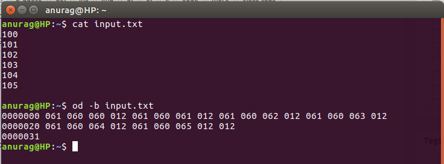
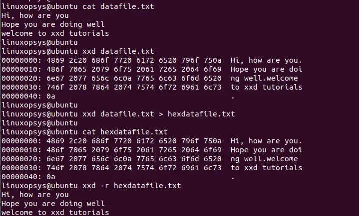
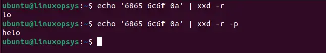

# Cheat Sheet FVAN

CyberSecurity and virtualisation

## Crack the zip

The zip file can be easily cracked using John the ripper using the default (builtin) word list:

```console
zip2john wifi-captures.zip > hash.txt
john hash.txt
```

## Crack the wifi

### WEP encryption 64 bit

```console
aircrack-ng -n 64 wep-easy-01.ivs
```

### WEP encryption 128 bit

```console
aircrack-ng -n 128 wep-medium-01.ivs
```

### WPA encryption

```console
aircrack-ng -w /usr/share/wordlists/rockyou.txt wpa-easy-01.cap
```

### WPA encryption (only one 4-way handshakes) (use **crunch**)

```console
sudo locale-gen en_US.UTF-8       # configure locale UTF-8
crunch 6 8 abcdef -o custom.txt   # create custom wordlist
aircrack-ng -w custom.txt wpa-medium-01.cap
```

### aircrack usage examples

<https://www.kali.org/tools/aircrack-ng/>

## Update locate

```console
sudo updatedb
```

## Wordlist

### Search wordlist (**locate**)

```console
locate wordlist
```

### Unzip wordlist

```console
cd /usr/share/wordlist/
sudo gzip -d rockyou.txt.gz
```

## Gateway + DNS

### Remove firewall

```console
dnf remove firewalld
```

### Enable routing

```console
modprobe iptable_nat
echo "net.ipv4.ip_forward = 1" >> /etc/sysctl.conf
sysctl -p /etc/sysctl.conf # reload sysctl.conf variables
sysctl net.ipv4.ip_forward       # Verify if IP forwarding is active
```

### check if nat is installed

```console
iptables -t nat -L
```

### Configure static IP

```console
dnf install nano          # Install basic text editor
nano /etc/sysconfig/network-scripts/ifcfg-enp0s8
```

```console
TYPE=Ethernet
BOOTPROTO=none
IPADDR=192.168.22.1
NETMASK=255.255.255.0
NAME=enp0s8
DEVICE=enp0s8
ONBOOT=yes
```

```console
systemctl reboot -i
```

Save the file, reboot the VM and verify the IP configuration (using ip a s).

### Configure NAT (enp0s3 connected to NAT, enp0s8 connected to internal)

```Console
iptables -t nat -A POSTROUTING -o enp0s3 -j MASQUERADE
iptables -A FORWARD -i enp0s8 -j ACCEPT
```

## Configure DNS

```console
dnf install bind bind-utils -y
nano /etc/named.conf
```

```console
Modify the following lines to change listener and add forwarder:

options{
    listen-on port 53 { 127.0.0.1; 192.168.22.1; };     # Change this line
    #listen-on-v6 ..                                    # Comment out this line
    ...
    allow-query { any; };                               # Change this line
    forwarders {8.8.8.8;};                              # Add this line
    ...
    #recursion yes;             # Comment out this line to disable recursion
    #dnssec-validation yes;     # Comment out this line to disable DNSsec
}
...
#include "/etc/named.rfc1912.zones";                # Comment out
#include "/etc/named.root.key";                     # Comment out
```

Verify configuration and start/enable named service:

```console
named-checkconf           # No output = good configuration file!
systemctl start named     # Start DNS server
systemctl enable named    # Auto-start during boot
```

## DHCP

### Configure static IP (enp0s3 connected to internal)

```console
dnf install nano          # Install basic text editor, requires internet! Alternatively, vi can be used
nano /etc/sysconfig/network-scripts/ifcfg-enp0s3
```

### Add the following lines to the interface file

```console
TYPE=Ethernet
BOOTPROTO=none
IPADDR=192.168.22.2
NETMASK=255.255.255.0
NAME=enp0s3
DEVICE=enp0s3
ONBOOT=yes
GATEWAY=192.168.22.1
DNS1=192.168.22.1
```

Don't forget the bottom 2 lines (gateway and dns)! Reboot and check if you can ping the gateway.

### Install and configure DHCP

```console
dnf install dhcp-server       # Now dhcp-server instead of dhcp!
nano /etc/dhcp/dhcpd.conf     # Edit the DHCP server config
```

Add the following lines to dhcpd.conf:

```console
subnet 192.168.22.0 netmask 255.255.255.0 {
        option routers                  192.168.22.1;
        option subnet-mask              255.255.255.0;
        option domain-name-servers      192.168.22.1;
        range 192.168.22.101 192.168.22.150;
}
```

Save the file and exit nano. Start and enable the DHCP service:

```console
systemctl start dhcpd
systemctl enable dhcpd
```

## static file analysis

### filehash

windows

```powershell
Get-FileHash notepad.exe
```

Linux

```console
sha256sum notepad.exe
```

### file

helps determine the type of a file and its data

```console
file [option] [file name]
```

Using the -s option lets you fully test special files:

```console
sudo file -s /dev/sda5
```

Use the -z option to fully test compressed files, trying to detect their content:

```console
file -z install.tar.gz
```

### od

od command in Linux is used to convert the content of input in different formats with octal format as the default format

```console
od [OPTION]... [FILE]...
```

Displays the contents of input in octal format.

```console
od -b input.txt
```



### xxd / hexdump

The xxd command is a hex dumper. This means it takes a standard input or a file and then converts it to hexadecimal. It can also convert hex dump back to binary form.

```console
xxd [options] [file]
```

Binary Display

```console
xxd -b datafile.txt
```

Reverse Operation

xxd also offers to reverse a hex dump back to binary using the -r option.

```console
xxd -r filename or xxd -r -p inputhexfile.txt output.bin
```



To revert by skipping the first character, take input from piped standard out:

```console
echo '6865 6c6f 0a' | xxd -r -p
```



```console
hexdump -C
```


### rename a file

```console
mv oldfilename newfilename
```

### grep a file

```console
grep --text -i "author" pdf
```

### recap hexadecimals

How many bits are in 1 hexadecimal number?

4

How many bits are in 1 byte?

8

How many hexadecimal numbers do we need to represent a byte?

2

0x1A corresponds to which decimal value?

26 (16+10)

### strings

Het stringscommando zal een poging doen om alle tekst (ASCII) uit een bestand te interpreteren en te tonen.

```console
strings pdf | grep --text -i "author"
```


### wget

```console
wget -O filename.zip http://www.domain.com/filename-4.0.1.zip
```

```console
 wget https://upload.wikimedia.org/wikipedia/commons/3/3f/Superman-Logo.jpg
```

### change in hexa

Try to change the comment "LEAD Technologies Inc. V1.01" to "AAAA Technologies".

```console
xxd Superman-Logo.jpg > supes.hex
vim supes.hex
Change to 41 (A in Hex)
xxd -r supes.hex > supes.jpg
```

### translate to hexa

```console
echo -n "Hello" | od -A n -t x1
```

### not stripped

 it contains debugging information. That means for each instruction there is information which line of the source code generated it, the name of the variables in the source code is retained and can be associated to the matching memory at runtime etc

### dynamically linked

It uses shared libraries, in other words not everything "needed" by the executable is in the executable itself. You can see the dependencies with ldd.

### find shared libraries in executable

file evil


readelf -a evil | grep -i shared


sudo find / -name "libc.so.6" 2>/dev/null


### dd

Manipulate files on a byte level

```console
sudo dd if=/dev/sda bs=512 count=1 of=mbr.img
```

Create a backup from the first 512 bytes of the sda partition --> backup of the mbr

```console
sudo dd if=/dev/cdrom of=/mycd.iso
```

Create a backup from a file/cdrom

```console
sudo dd if=/dev/zero bs=1M of=/dev/sdx (with x for example a: /dev/sda)
```

Wiping a device

Now take a look at the following one-liner and do run it:

```console
dd if=/dev/zero of=file bs=1024K count=500.
```

Analyze the file: how big is it, what are the contents?

500MB, all filled with zeros

Create a file, using dd, that writes 100 random bytes in a file.

```console
dd if=/dev/urandom of=file bs=1 count=100
```

Finally, try to figure out a way, using dd, to make a duplicate of a file but skipping the first 20 bytes of the file.

```console
dd if=file of=export_without_first_20_and_last_16 skip=20 seek=16 bs=1 count=80
```

### The final (and a bit harder) challenge

```console
file challenge 
```

--> shows "data" :(


```console
strings challenge 
```

--> shows something weird: "hiddeninplainsight" but nothing more; we do see "rgb" (foreshadowing: if you would use strings -3 you would notice PNG as well)


```console
xxd challenge | head 
```


--> we see the PNG!
Think for a minute and zoom out: we see PNG in hex but file is not showing png, it says "data"? --> Why? --> because something is wrong with the header.

a.first bytes (hiddeninplainsight) need to be removed
b. When closely looking at the header the 8850 needs to be 8950, see wikipedia for the header of a PNG file.


```console
xxd challenge | head --> we see the PNG!
xxd challenge > challenge.hex
vim ./challenge.hex
xxd -r challenge.hex challenge2
dd if=challenge2 of=challengeFixed bs=1 skip=18
```


## Nmap en scan

### Powershell ping sweep

```powershell
1..20 | % {"192.168.1.$($_): $(Test-Connection -count 1 -comp 192.168.1.$($_) -quiet)"}
```
